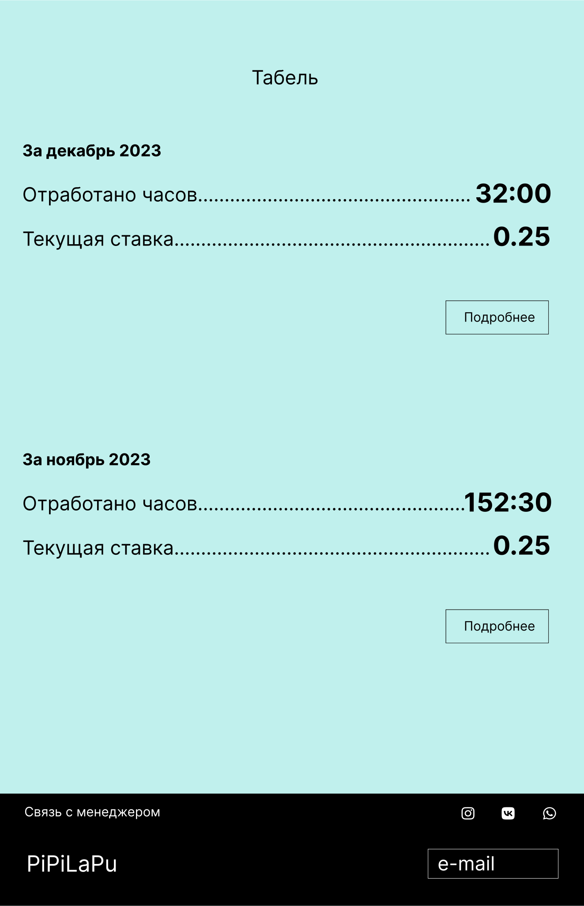

<!DOCTYPE html>
<html lang="en">
<head>
  <meta charset="UTF-8">
  <meta name="viewport" content="width=device-width, initial-scale=1.0">
  <meta http-equiv="X-UA-Compatible" content="ie=edge">
  <title>Document</title>
  <link rel="preconnect" href="https://fonts.googleapis.com">
<link rel="preconnect" href="https://fonts.gstatic.com" crossorigin>
<link href="https://fonts.googleapis.com/css2?family=Inter:wght@400;700&display=swap" rel="stylesheet">
  <link rel="stylesheet" href="css/reset.css">
  <link rel="stylesheet" href="css/ta.css">

  
  <header class="header">
    

      

        
        
        <nav class="menu">
          <ul class="menu__list">
            <li class="menu__item">
              <a href="#" class="menu__link" > 
                PiPiLaPu
              </a>
            </li>
          </ul>
        </nav>
        <search>
          
       
            <button class="btn">
              
            </button>
          

        </search>
      

  </header>
  <viva class="viva">
    

      

        <nav class="mens__action">
          <ul class="mens__list">
            <li class="mens__item">
              
              
            </li>
          </ul>
        </nav>
      

    

  </viva>
  

              
  

 

</head>
<body>
