<!DOCTYPE html>
<html lang="en">
<head>
  <meta charset="UTF-8">
  <meta name="viewport" content="width=device-width, initial-scale=1.0">
  <meta http-equiv="X-UA-Compatible" content="ie=edge">
  <title>Document</title>
  <link rel="preconnect" href="https://fonts.googleapis.com">
<link rel="preconnect" href="https://fonts.gstatic.com" crossorigin>
<link href="https://fonts.googleapis.com/css2?family=Inter:wght@400;700&display=swap" rel="stylesheet">
  <link rel="stylesheet" href="reset.css">
  <link rel="stylesheet" href="/style.css">
</head>
<body>
  
<header class="header">
  

    

      
      
      <nav class="menu">
        <ul class="menu__list">
          <li class="menu__item">
            <a href="#" class="menu__link" >PiPiLaPu
            </a>
          </li>
          
        </ul>
      </nav>
      
        
          <button class="btn">
            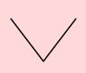
          </button>
              
      
    

</header>

<viva class="viva">
  

    

      <nav class="mens__action">
        <ul class="mens__list">
          <li class="mens__item">
            <a href="file:///D:/VisualStudio/start-clean/start-clean/il.html" class="tabel">
              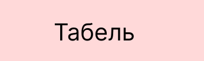
            </a>
            
          </li>
        </ul>
      </nav>
    

  

</viva>

<main class="main">
    <section class="top">
            

                <h1 class="top__title">
                  
                </h1>
                
            

    </section>
</main>
<knop class="knop">
  

    
    <k0 class="k0">
        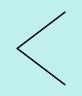
    </k0>
    <k1 class="k0">
        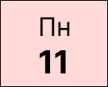
    </k1>
    <a class="k0" href="file:///D:/VisualStudio/start-clean/start-clean/cookie2.html">
        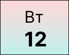
    </a>
    <k3 class="k0">
        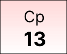
    </k3>
    <k4 class="k0">
        
    </k4>
    <k5 class="k0">
        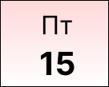
    </k5>
    <k6 class="k0">
        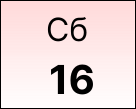
    </k6>
    <k7 class="k0">
        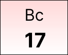
    </k7>
    <k8 class="k0">
        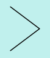
    </k8>
  

</knop>

<adres class="adres">
  

    

    <a class="a1" href="file:///D:/VisualStudio/start-clean/start-clean/i.html">
        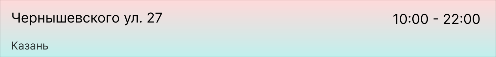
    </a>
    

    

      <a2 class="a2" >
        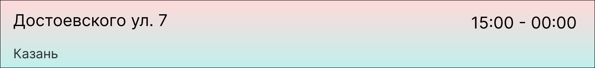
      </a2>
      

    

      <a3 class="a3">
        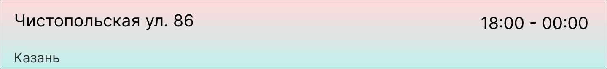
      </a3>
    

    

      <a4 class="a4">
        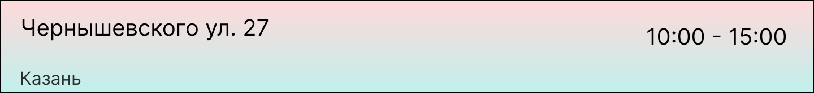
      </a4>
    

    

      <a5 class="a5">
        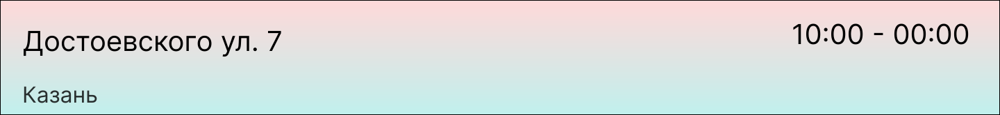
      </a5>
    

  
  
</adres>

<dno class="dno">
  

    
  

 
</body>
</html>
<!DOCTYPE html>
<html lang="en">
<head>
  <meta charset="UTF-8">
  <meta name="viewport" content="width=device-width, initial-scale=1.0">
  <meta http-equiv="X-UA-Compatible" content="ie=edge">
  <title>Document</title>
  <link rel="preconnect" href="https://fonts.googleapis.com">
<link rel="preconnect" href="https://fonts.gstatic.com" crossorigin>
<link href="https://fonts.googleapis.com/css2?family=Inter:wght@400;700&display=swap" rel="stylesheet">
  <link rel="stylesheet" href="css/reset.css">
  <link rel="stylesheet" href="css/style.css">
</head>
<body>
  
<header class="header">
  

    

      
      
      <nav class="menu">
        <ul class="menu__list">
          <li class="menu__item">
            <a href="#" class="menu__link" >PiPiLaPu
            </a>
          </li>
          
        </ul>
      </nav>
      
        
          <button class="btn">
            
          </button>
              
      
    

</header>

<viva class="viva">
  

    

      <nav class="mens__action">
        <ul class="mens__list">
          <li class="mens__item">
            
            
          </li>
        </ul>
      </nav>
    

  

</viva>

<main class="main">
    <section class="top">
            

                <h1 class="top__title">
                  
                </h1>
                
            

    </section>
</main>
<knop class="knop">
  

    
    <k0 class="k0">
        
    </k0>
    <k1 class="k0">
        
    </k1>
    
    <k3 class="k0">
        
    </k3>
    <k4 class="k0">
        
    </k4>
    <k5 class="k0">
        
    </k5>
    <k6 class="k0">
        
    </k6>
    <k7 class="k0">
        
    </k7>
    <k8 class="k0">
        
    </k8>
  

</knop>

<adres class="adres">
  

    

    
    

    

      <a2 class="a2" >
        
      </a2>
      

    

      <a3 class="a3">
        
      </a3>
    

    

      <a4 class="a4">
        
      </a4>
    

    

      <a5 class="a5">
        
      </a5>
    

  
  
</adres>

<dno class="dno">
  

    
  

 
</body>
</html>
